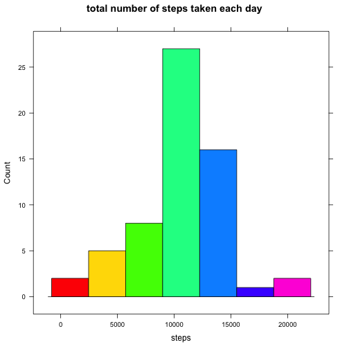

## Loading and preprocessing the data


```r
if(!file.exists("./activity.csv")){
        unzip("./activity.zip")
}
activitydata<-read.csv("activity.csv")
```

## What is mean total number of steps taken per day?


```r
#Calculate the total number of steps taken per day
stepsByDate<-aggregate(steps ~ date, activitydata, sum)

#Make a histogram of the total number of steps taken each day
suppressWarnings(library("lattice"))
histogram(
        ~steps
        , data = stepsByDate
        , type = "count"
        , main = "total number of steps taken each day"
        ,col=rainbow(30)
)
```

 

```r
#Calculate and report the mean and median of the total number of steps taken per day
summary(stepsByDate$steps)
```

```
##    Min. 1st Qu.  Median    Mean 3rd Qu.    Max. 
##      41    8841   10760   10770   13290   21190
```

## What is the average daily activity pattern?

```r
#Calculate the average number of steps taken per interval
averageStepsByInterval<-aggregate(steps ~ interval, activitydata, mean)
plot(averageStepsByInterval, type = "l",main="average daily activity pattern")
```

 

```r
#Get max of the average number of steps taken per interval
averageStepsByInterval[averageStepsByInterval$steps == max(averageStepsByInterval$steps),]
```

```
##     interval    steps
## 104      835 206.1698
```


## Imputing missing values

```r
#Calculate and report the total number of missing values in the dataset
nrow(activitydata[is.na(activitydata),])
```

```
## [1] 2304
```

```r
#Replace missing NA's with mean value by interval
suppressWarnings(library(plyr))
impute.mean <- function(x) replace(x, is.na(x), mean(x, na.rm = TRUE))
activitydata2<-ddply(activitydata, ~ interval, transform, steps = impute.mean(steps))

#Calculate the total number of steps taken per day
stepsByDate<-aggregate(steps ~ date, activitydata2, sum)

#Make a histogram of the total number of steps taken each day
histogram(
        ~steps
        , data = stepsByDate
        , type = "count"
        , main = "total number of steps taken each day"
        ,col=rainbow(7)
)
```

 

```r
#Calculate and report the mean and median of the total number of steps taken per day
summary(stepsByDate$steps)
```

```
##    Min. 1st Qu.  Median    Mean 3rd Qu.    Max. 
##      41    9819   10770   10770   12810   21190
```


## Are there differences in activity patterns between weekdays and weekends?

```r
#Add factor variable in the dataset with two levels – “weekday” and “weekend”
activitydata2$daytype<-factor(
        mapvalues(
                weekdays(as.Date(activitydata2$date), abbreviate = TRUE)
                , from = c('Mon','Tue','Wed','Thu','Fri','Sat','Sun')
                , to = c(rep('weekday',5),rep('weekend',2))
        )
)

attach(activitydata2)
par(mfrow=c(2,1))
plot(
        aggregate(
                steps ~ interval
                , activitydata2[activitydata2$daytype == 'weekend',]
                , mean
        )
        ,type = "l"
        , main="Activity pattern at Weekends"
        ,ylim=c(0,300)
)
plot(
        aggregate(
                steps ~ interval
                , activitydata2[activitydata2$daytype == 'weekday',]
                , mean
        )
        ,type = "l"
        , main="Activity pattern at Weekdays"
        ,ylim=c(0,300)
)
```

 

